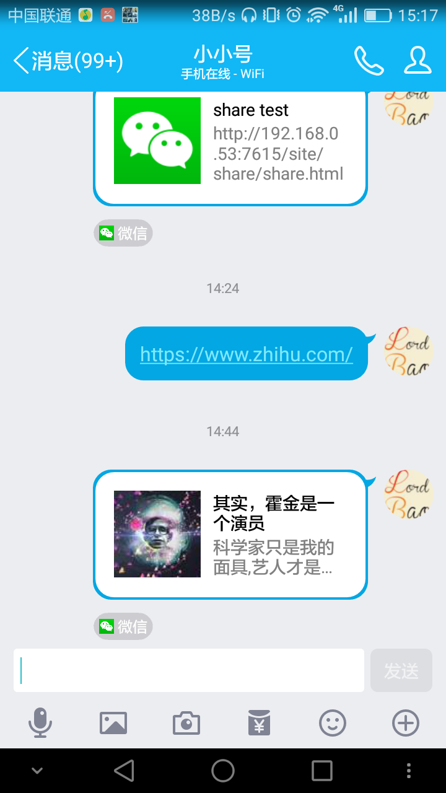
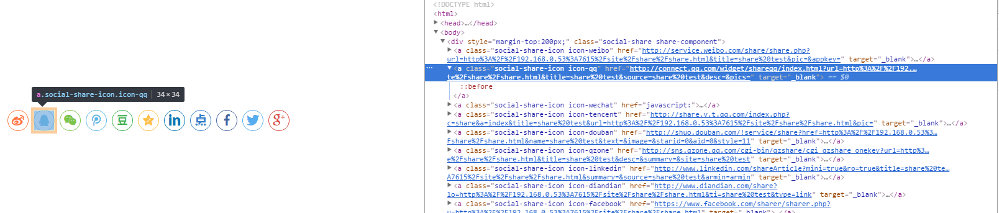
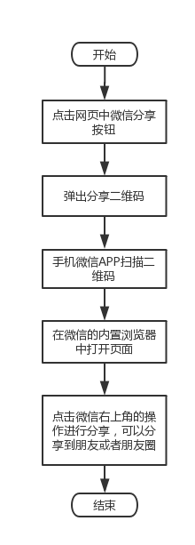

# 1. 背景

最近业务中遇到分享网页的需求，被分享的页面显示的环境：PC浏览器，手机浏览器和APP中的WebView中。

1. PC浏览器中

    这里的页面，浏览器本身没有提供分享的功能，这里只能通过页面中的分享入口来分享

2. 手机浏览器中

    手机中的浏览器APP，右上角默认都有一个分享的功能。选择分享的地方，使用浏览器的分享功能分享出去，这里有个问题就是分享出去仅仅是一个链接，非常丑。

3. APP的 WebView 中

    这个里面的分享功能，应该是原生代码实现，暂不考虑。

**一个好的分享具有什么样的特点：**

1. 不是一个干巴巴的链接

2. 有标题

3. 有内容摘要

4. 有缩略图

5. 最好有公司的来源标志（来源的这个好像是被分享的对象，如分享到QQ，QQ自己检测的）

类似这种：



# 2. share.js

分析一个开源的分享插件，了解 web 分享到底是个什么过程。[项目地址](https://github.com/overtrue/share.js)

先引入 `share.js` 写一个 `demo` 看看效果。

```
<!DOCTYPE html>
<html>
<head>
  <title>share test</title>
  <meta charset="utf-8">
  <link rel="stylesheet" type="text/css" href="dist/css/share.min.css">
  <meta name="viewport" content="width=device-width, initial-scale=1, maximum-scale=1, user-scalable=0" />
</head>
<body>
<div style="margin-top:200px;" class="social-share"></div>
</body>
<script type="text/javascript" src="dist/js/social-share.min.js"></script>
</html>
```

显示效果



可以看到，点击分享图标，执行的是一个打开网页的操作，打开网页后，分享的流程就交给第三方服务提供者了，如QQ。这里我们去看看 `share.js` 中每个分享的 `url` 和参数是什么。

```
    var templates = {
        qzone: 'http://sns.qzone.qq.com/cgi-bin/qzshare/cgi_qzshare_onekey?url={{URL}}&title={{TITLE}}&desc={{DESCRIPTION}}&summary={{SUMMARY}}&site={{SOURCE}}',
        qq: 'http://connect.qq.com/widget/shareqq/index.html?url={{URL}}&title={{TITLE}}&source={{SOURCE}}&desc={{DESCRIPTION}}&pics={{IMAGE}}',
        tencent: 'http://share.v.t.qq.com/index.php?c=share&a=index&title={{TITLE}}&url={{URL}}&pic={{IMAGE}}',
        weibo: 'http://service.weibo.com/share/share.php?url={{URL}}&title={{TITLE}}&pic={{IMAGE}}&appkey={{WEIBOKEY}}',
        wechat: 'javascript:',
        douban: 'http://shuo.douban.com/!service/share?href={{URL}}&name={{TITLE}}&text={{DESCRIPTION}}&image={{IMAGE}}&starid=0&aid=0&style=11',
        diandian: 'http://www.diandian.com/share?lo={{URL}}&ti={{TITLE}}&type=link',
        linkedin: 'http://www.linkedin.com/shareArticle?mini=true&ro=true&title={{TITLE}}&url={{URL}}&summary={{SUMMARY}}&source={{SOURCE}}&armin=armin',
        facebook: 'https://www.facebook.com/sharer/sharer.php?u={{URL}}',
        twitter: 'https://twitter.com/intent/tweet?text={{TITLE}}&url={{URL}}&via={{ORIGIN}}',
        google: 'https://plus.google.com/share?url={{URL}}'
    };
```

可以看到分享一般执行的都是一个链接的后面加上参数。下面我们列出不同分享途径需要的参数。

# 3. 不同分享途径的参数

## 3.1 分享到 QQ

```
(function() {
  var p = {
    url: location.href,
    title : '其实，霍金是一个演员',
    summary : '科学家只是我的一个面具，艺人才是我真正的灵魂。',
    pics : 'http://www.tdx.com.cn/images/tdxapp.jpg',
  };
  var s = [];                
  for (var i in p) {
    s.push(i + '=' + encodeURIComponent(p[i] || ''));
  }
  // debugger;
  document.write(['<a class="qcShareQQDiv" href="http://connect.qq.com/widget/shareqq/index.html?', s.join('&'), '"target="_blank">分享到QQ</a>'].join(''));
})();
```

`url`: 分享链接地址

`title`: 分享出去的标题

`summary`: 分享出去的摘要

`pics`: 缩略图地址

> 这个缩略图地址最好是个外网地址，个人测试的时候，给了一个图片地址，老是出不来。最后发现是QQ根据填的本地地址取不到图片。

## 3.2 分享到QQ空间

分享到QQ空间的参数和分享到QQ一样。

## 3.3 分享到微博

微博分享 `url`: `http://service.weibo.com/share/share.php?url={{URL}}&title={{TITLE}}&pic={{IMAGE}}&appkey={{WEIBOKEY}}`

`url`：分享链接地址

`title`: 分享标题

`pic`: 分享缩略图

## 3.4 分享到微信

微信没有查询到类似 QQ 那样的分享链接，目前看到的一些微信分享，一般是这样的流程：



这里可以看到，其实用微信扫二维码或者是手机的其他APP（如`UC`）扫描二维码，都是在浏览器中打开这个链接，至于分享的功能，其实是微信或者 `UC` 提供的。但是如何设置我们这个被分享的页面，使得分享出去的信息，是一个漂亮的内容（有title，描述和缩略图）。