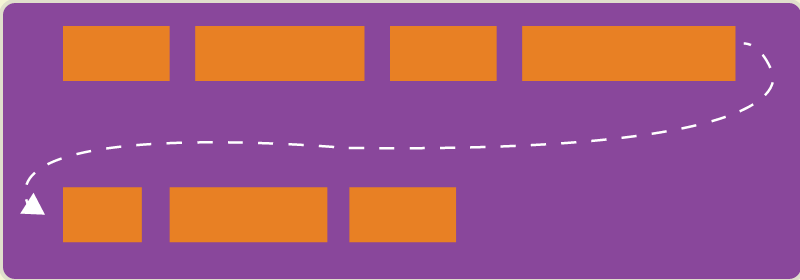
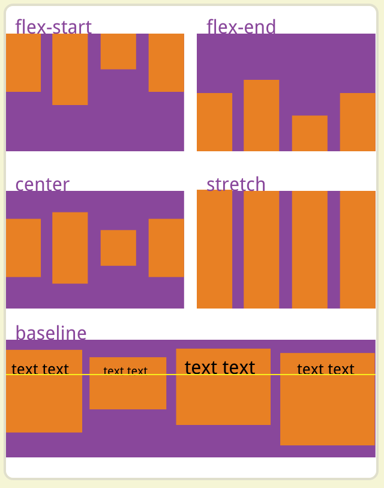
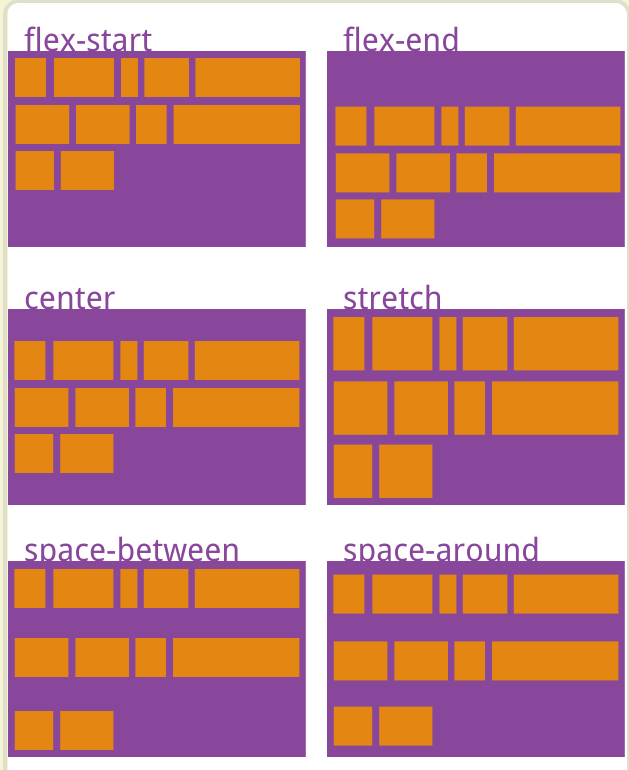
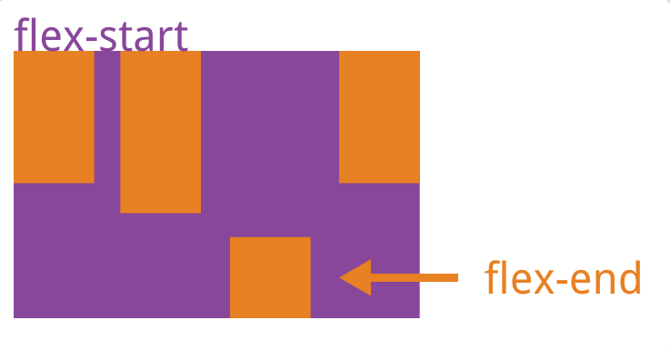

## 传统的布局是基于盒模型, 什么是盒模型? 

1. margin 	外间距
2. border 	边框
3. padding 	内间距
4. 具体的内容
5. float	是否浮动?

这个布局一般是什么样的? `display` + `position` + `float`

	// 达到居中效果
	{
		display: block;
		width: 100px;
		margin: auto auto;
	}

但是垂直居中,不好实现.  `line-height`?

flex是一种新的布局,并慢慢成为主流.

---

## 什么是 flex

这是一个 css3 属性, 浏览器的支持情况:

flex 相对于传统的优势, 网上的例子都是使用垂直居中来说.

水平轴(main axis), 纵轴(cross axis).

---

## 容器属性

2个概念 `container(容器)` 和 `item(项目)`. 简单说, 如果定义一个元素为 flex 布局, 那么他的子元素自动成为了 flex 布局的项目.

`container` 有如下属性:

	flex-direction
	flex-wrap
	flex-flow  (*)
	justify-content (*)
	align-items  (*)
	align-content

### flex-direction 

项目(item)排列方向, 可取4个值: 

1. `row` 			默认值, 水平方向排列, 起点在左端
2. `row-inverse` 	水平方向排列, 起点在右端
3. `column` 	 	纵轴方向排列, 起点在上方
4. `column-inverse`	纵轴方向排列, 起点在下方

### flex-wrap

是否换行, 可取3个值:

1. `nowrap`			默认值, 不换行
2. `wrap`			换行, 第一行在上方
3. `wrap-reverse`	换行, 第一行在下方

### flex-flow

flex-direction 和 flex-wrap 的简写

	.container {
		flex-flow: row nowrap;  // 默认
	}

建议使用简写

### justify-content

定义 item 在主轴(水平轴)上的对齐方式, 可取5个值:

1. `flex-start`		默认值, 左对齐
2. `flex-end`		右对齐
3. `center`			居中
4. `space-between`	两端对齐, 项目(item)之间间距相等
5. `space-around`	每个项目2侧的间隔相等, 项目间的间隔比项目与边框的间隔大一倍

### align-items

定义项目在交叉轴(纵轴)上的对齐方式, 可取5个值:

1. `flex-start`		纵轴上方对齐
2. `flex-end`		纵轴下方对齐
3. `center`			纵轴中间对齐
4. `base-line`		项目第一行文字基线对齐
5. `stretch`		默认值, 如果项目未设置高度, 那么将占整个容器的高度

### align-content

定义多根轴线的对齐方式. 如果只有一根轴线, 则不起作用, 可取6个值:

1. `flex-start`		与纵轴起点对齐
2. `flex-end`		与纵轴终点对齐
3. `center`			与纵轴中点对齐
4. `space-between`	纵轴两端对齐，轴线间间隔平均分布
5. `space-around`	纵轴间隔相等
6. `stretch`		轴线占满整个纵轴

---

## 项目属性

	order
	flex-grow
	flex-shrink
	flex-basis
	flex
	align-self

### order

定义项目的排列顺序，值越小越靠前。 默认值为0

### flex-grow

定义项目的放大比例， 默认为0. 即有剩余空间也不放大。

	.item {
		flex-grow: 1;
	}

如果有3个项目，都含有类 item，则这3个项目等分容器空间（水平方向）。

### flex-shrink

定义项目的缩放比例，默认值为1.即空间不足，该项目将缩小。值0，不缩放。负值无效。

### flex-basis

定义项目在分配多余的空间之前，项目占据主轴空间。默认值 auto

	.item {
		flex-basis: 300px;
	}

上述效果，项目占据固定空间。

### flex

是 flex-grow, flex-shrink, flex-basis 的简写。
	
	{
		flex-grow: 0 1 auto;
	}

建议优先使用这个属性，而不是单独写3个分离的属性，因为浏览器会推算相关值。

### align-self

设置单个项目与其他项目不一样的对齐方式，可覆盖容器的 align-item 属性。

默认值为 auto，表示继承容器的 align-items 属性。如果没有父元素则默认值为 stretch。

## 实例

1. 设置 flex 后, 子节点的某些属性就失效了: float , block 等

	[实例1](flex1.html)

2. 实例2，item也可以再次成为container

	[实例2](flex2.html)

## 参考

[阮一峰flex介绍](http://www.ruanyifeng.com/blog/2015/07/flex-grammar.html?utm_source=tuicool)