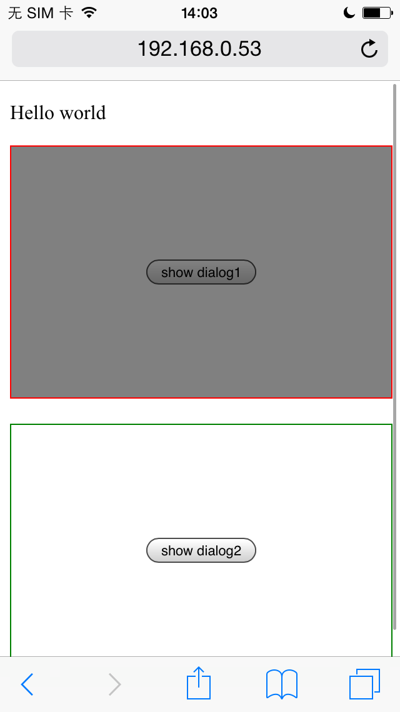
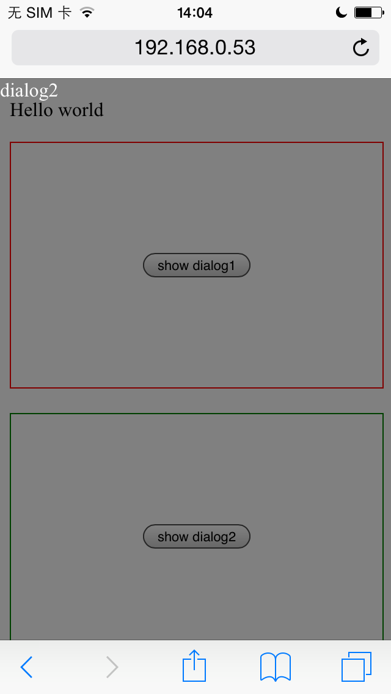

最近在 `ios` 环境下发现一个奇怪的现象。`css` 属性 `position:fixed;` 在设置 `-webkit-overflow-scrlling`
为 `touch` 和 `auto` 时表现不一样

1. 当为 `touch` 的时候，会发现 `position:fixed;` 这个属性的子元素还是在父元素中

2. 为 `auto` 时，是一个正常的 `position:fixed;` 的显示。

**示例代码**

```
<!DOCTYPE html>
<html>
<head>
  <title>-webkit-overflow-scroll: touch & position: fixed</title>
  <meta charset="utf-8">
  <meta name="viewport" content="width=device-width, initial-scale=1.0, maximum-scale=1.0, minimum-scale=1.0, user-scalable=no">
  <style type="text/css">
    
  .box, .box2 {
    height: 200px;
    width: 100%;
    overflow: auto;
    -webkit-overflow-scrolling: touch;
    border: 1px solid red;
    display: -webkit-box;
    display: -ms-flexbox;
    display: flex;
    -webkit-box-pack: center;
        -ms-flex-pack: center;
            justify-content: center;
    -webkit-box-align: center;
        -ms-flex-align: center;
            align-items: center;
  }

  .box2 {
    margin-top: 20px;
    border-color: green;
    -webkit-overflow-scrolling: auto;
  }

  .dialog {
    position: fixed;
    top: 0;
    left: 0;
    right: 0;
    bottom: 0;
    background-color: rgba(0, 0, 0, 0.5);
    display: -webkit-box;
    display: -ms-flexbox;
    display: flex;
    -webkit-box-pack: center;
        -ms-flex-pack: center;
            justify-content: center;
    -webkit-box-align: center;
        -ms-flex-align: center;
            align-items: center;
    color: #fff;
  }

  </style>
</head>
<body>

<p>Hello world</p>
<div class="box">
  <button onclick="showDialog1()">show dialog1</button>
  <div 
    id="dlg1" 
    onclick="hideDialog(event)" 
    class="dialog" 
    style="display:none;"
  ><span>dialog1</span></div>
</div>
<div class="box2">
  <button onclick="showDialog2()">show dialog2</button>
  <div 
    id="dlg2" 
    onclick="hideDialog(event)" 
    class="dialog" 
    style="display:none;"
  ><span>dialog2</span></div>
</div>

</body>
<script type="text/javascript">
  
var showDialog1 = function() {

  var el = document.getElementById("dlg1");
  el.style.display = "block";
}

var showDialog2 = function() {
  var el = document.getElementById("dlg2");
  el.style.display = "block";
}

var hideDialog = function(e) {

  var el = e.target;
  el.style.display = "none";
}

</script>
</html>
```

**显示现象：**

1. -webkit-overflow-scrolling: touch

    

2. -webkit-overflow-scrolling: auto

    