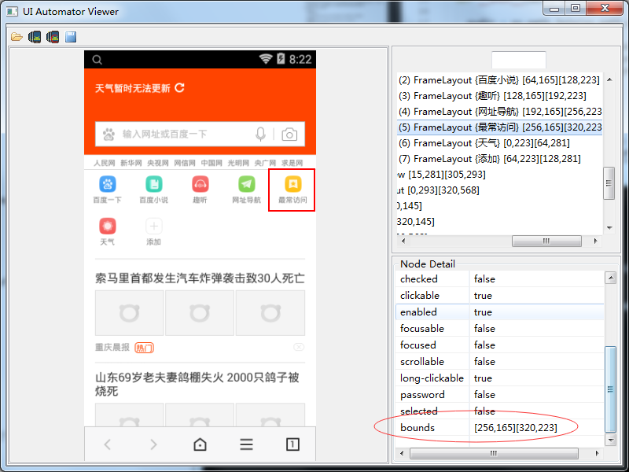
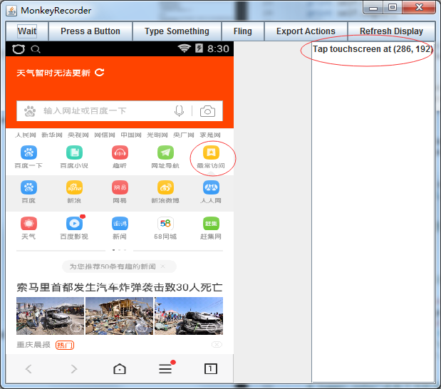
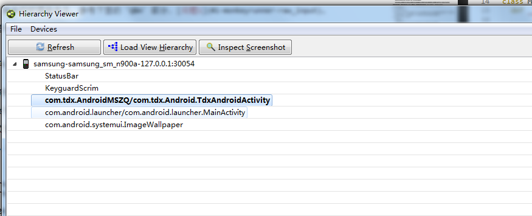
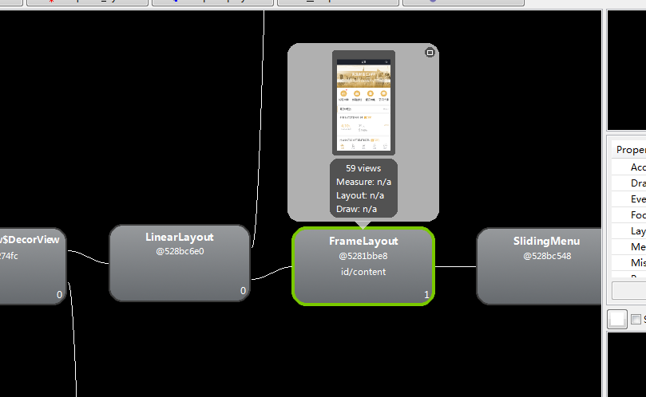
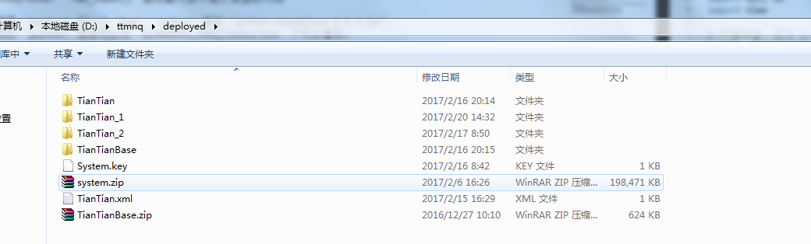

这里总结如何使用 `monkeyrunner` 来自动化测试 `android apk` 应用。

# 1. 环境准备

### 1.1 `python` 安装

下载 `python` 的 `msi` 包，直接点击 `next`，安装。

### 1.2 `java jdk` 安装

因为 `android sdk` 这些是基于 `java jvm`，所以需要需要 `java jdk` 环境

### 1.3 `android sdk` 安装

使用 `android sdk manager` 管理工具，来安装 `android sdk tools` 和 `android sdk platform_tools`。这里也需要安装一个版本的 `sdk platform`，
截图如下：

由于 `GWF` 的原因，使用 `google` 的源安装 `sdk` 比较困难，我们可以换成国内的源。[点击这里](http://www.jianshu.com/p/53080a8cbc95)

### 1.4 `windows` 下配置环境变量

`monkeyrunner` 是 `android platform_tools` 中提供的一个自动化测试接口工具。可以通过脚本来模拟 `APP` 业务流程。

这里配置

    JAVA_HOME=[你的 Java jre 文件存放根路径]

    ANDROID_HOME=[你的 Android sdk 文件存放根路径]

    Path=%JAVA_HOME%\bin;%JAVA_HOME%\lib;%ANDROID_HOME%\tools;%ANDROID_HOME%\platform-tools;C\python

这里这样设置，是为了可以在 `dos` 情形下，直接执行对应的命令，如 `python`, `monkeyrunner`。

至此，环境搭建成功。

# 2. MonkeyRunner 是什么

`MonkeyRunner` 是一个测试工具，通过运行 `python` 脚本来模拟 `Android` 手机界面的点击事件来测试。一般测试步骤：

    模拟界面点击事件 --> 事件结果截图 --> 截图与正确图片比较来判断测试结果是否通过

来一段简单的 `python` 测试脚本：

    # hello.py
    # coding: utf-8

    from com.android.monkeyrunner import MonkeyRunner, MonkeyDevice, MonkeyImage

    # 连接设备
    device = MonkeyRunner.waitForConnection([delay secs], [deviceid]);

    # 安装APP
    apkFilePath = "E:/myapp.apk";
    device.installPackage(apkFilePath);

    # 启动 APP
    # 自行 google package 和 activity 是什么
    package = "com.test.myapp";
    activity = "com.test.Android.myappActivity";
    runComponent = package + "/" + activity;
    device.startActivity(component=runComponent);

    # 这里一般让脚本暂停一段时间，使得APP成功启动起来
    MonkeyRunner.sleep(3);

    # 下面开始模拟界面事件
    # 1. 点击事件
    device.touch(x, y, "DOWN_AND_UP");
    MonkeyRunner.sleep(1);

    # 2. 输入事件
    # 先发焦点聚焦到输入控件上，然后 type 内容
    device.touch(x, y, "DOWN_AND_UP");
    MonkeyRunner.sleep(1);
    device.type(value);
    MonkeyRunner.sleep(1);

    # 3. 模拟按键按下，如后退，home按键按下
    # 这里第一个参数值的定义可以
    devie.press("KEYCODE_BACK", "DOWN_AND_UP");
    MonkeyRunner.sleep(1);

    # 4. 界面滑动
    device.drag((x1, y1), (x2, y2));
    MonkeyRunner.sleep(1);

    # 点击事件触发，界面开始变化，截屏比较
    imagetobecompared = MonkeyRunner.loadImageFromFile([image file path]);
    screenshot = device.takeSnapshot();
    if screenshot.sameAs(imagetobecompared, 0.9):
      print "2张图片相同";
    else:
      print "2张图片不相同";

代码中的 `KEYCODE_BACK` 这样的取值，可以[参考](https://stuff.mit.edu/afs/sipb/project/android/docs/reference/android/view/KeyEvent.html)

按照上方测试流程，我们需要做什么：

1. 正确的截图如何获取并保存下来

1. 设定测试模拟器分辨率，然后获取控件坐标 `(x, y)`

缺陷有哪些：

1. 来点击控件是通过坐标来确定的，这样在不同分辨率的情形下，这个坐标是不一样的，测试不同分辨率机型要写不同的测试脚本

1. 图片的比对，这个不怎么准确

# 3. 我们需要做什么

`android sdk` 下提供了一些工具来帮助我们获取界面中控件的坐标，例如 `uiautomatorviewer`, `hierarchyviewer`, `monitor`。

### 3.1 uiautomatorviewer

这个可以打开后，通过点击界面上的控件，来获取控件的坐标。直接在 `dos` 下运行命令：

    uiautomatorviewer

执行后效果图：

这里可以看到 `bounds` 属性的值 `[256, 165][320, 223]`。这个是控件的左上和右下点的坐标，可以通过这2个点计算出中心点的坐标。

获取一个控件的坐标都这么麻烦。。。

### 3.2 MonkeyRecorder

这个工具提供了一套记录用户操作界面行为的操作，例如 `TOUCH`, `PRESS`, `TYPE`, `Drag` 这些操作。这个工具在 `tools`
或者 `platform-tools` 下都没有看到，不过可以通过代码来调用。

    # coding: utf-8

    from com.android.monkeyrunner import MonkeyRunner, MonkeyDevice, MonkeyImage
    from com.android.monkeyrunner.recorder import MonkeyRecorder as recorder

    device = MonkeyRunner.waitForConnection(3, "127.0.0.1:30054");

    # 启动 recorder
    recorder.start(device);

启动后的截图如下：

点击界面上的控件，或者 `type something`, 或者 `Fling` 这些操作，都会在右侧中留下操作记录，这里有点击点的坐标，
或者 `type value`这些操作。

导出操作到文件中，在 `py` 脚本文件中，实现起来就方便了。（强烈推荐这个来记录操作流程）

### 3.3 如何保存正确的截屏文件用于后续的比对

目前没有发现比较方便快捷的截屏保存操作。所以在这里实现了一小段截屏脚本，使用流程：

1. 启动模拟器，安装APP并启动我们需要测试的APP

2. 运行我们的脚本 `mkr console.py`，这里有个 `dos` 窗口

3. 在模拟器中操作APP，如果需要截屏，在步骤2中打开的 `dos` 窗口中输入 `save`，保存截图

附上代码：

`mkr.bat` 文件内容

    @echo off
    monkeyrunner %~dp0%1

`console.py` 文件内容

    # console.py
    # coding: utf-8

    # 连接模拟器
    ...

    # 这里开始根据输入的命令执行对应的操作
    # save: 截屏并保存 png 图片
    # quit：退出
    cmdstr = raw_input(">>>");
    while cmdstr != "quit":
      
      # 截图保存
      if cmdstr == "save":
        fpng = time.strftime("%Y%m%d%H%M%S", time.localtime()) + ".png";
        de.saveImage(os.path.join(pydir, "images", fpng), "png");

      cmdstr = raw_input(">>>");

注：

这里运行 `raw_input` 命令的时候会卡主。参考下面的 `Q&A` 部分，[问题1](#1-monkeyrunner-raw_input)。

# 4. 如何对付上述流程中的缺陷

### 4.1 控件坐标问题

使用空间坐标来操作控件，当屏幕分辨率改变时，控件坐标自然会改变。难道我们每个坐标都写一个测试脚本。
这里有2种解决方式：

1. 先固定一个屏幕分辨率，然后在新分辨率下重新计算控件坐标

2. 使用控件 `id` 来操作控件

方式1，假定我们的测试脚本是在 `320 * 568` 分辨率下控制控件 `(120, 200)` 来做点击操作。原来的代码

    device.touch(120, 200, "DOWN_AND_UP");

现在需要改为

    dw = device.getProperty("display.width");
    dh = device.getProperty("display.height");

    nx = int(120 / 320.0 * int(dw));
    ny = int(200 / 320.0 * int(dh));

另外一种方式是，通过控件 `id` 来获取控件，操作控件。对应的工具 `hierarchyviewer`

### 4.2 hierarchyviewer

在 `dos` 窗口下输入

    > hierarchyviewer

运行该命令的时候，最好先把模拟器的界面调整到你需要取控件 `id` 的控件。上方命令成功后，会有如下截图：

这时选中 `activity` 点击 `Load View Hierarchy` 显示如下界面：

这里看到有的控件的下方有 `id/content` 这样的内容，这个就是控件的 `id`。

使用代码示例如下：

    # coding: utf-8

    from com.android.monkeyrunner import MonkeyRunner, MonkeyDevice, MonkeyImage
    from com.android.chimpchat.hierarchyviewer import HierarchyViewer
    from com.android.monkeyrunner.easy import By

    device = MonkeyRunner.waitForConnection(1, "127.0.0.1:30054");

    hdevice = device.getHierarchyViewer();

    # 通过id获取node
    vnode = hdevice.findViewById("id/content");

    # 通过node，获取位置
    point = hdevice.getAbsolutePositionOfView(vnode);

    pcenter = hdevice.getAbsoluteCenterOfView(vnode);

    # 获取node中的文本内容
    txt = hdevice.getText(vnode);

### 4.3 EasyMonkeyDevice

    # coding: utf-8

    ...
    from com.android.monkeyrunner.easy import EasyMonkeyDevice
    from com.android.monkeyrunner.easy import By

    # 连接设备，启动APP
    ...

    easydevice = EasyMonkeyDevice(device);
    easydevice.touch(By.id("id/content"), MonkeyDevice.DOWN_AND_UP);

# Q & A

### 1. `monkeyrunner` `raw_input()` 接收输入后不运行后面的代码

这个被发现是 `jpython` 的一个 `bug`, `python` 版本 `jython-standalone-2.5.3.jar`。
当前你使用的 `jpython` 版本可以在 `${ANDROID_HOME}\tools\lib` 下可以看到。

fix：

[https://code.google.com/p/android/issues/detail?id=56318](https://code.google.com/p/android/issues/detail?id=56318)

### 2. 使用天天模拟器创建一个虚拟设备，使用 `adb devices` 检查不出来

这里是因为我们要手动连接天天模拟器，这里需要 `ip` 和 `port`。

从上面的截图，可以看到文件夹 `TianTian`, `TianTian_1`, `TianTian_2` ...

这里的每一个文件夹内容表示一个模拟器，我这里创建了3个模拟器，所以有三个文件夹。要连接哪个模拟器，查看对应
模拟器下的连接 `ip` 地址，可以查看下面内容：

    <!--/TianTian.vbox-->
    <VirtualBox ...>
      <Machine ...>
        ...
        <Hardware ...>
          ...
          <Network>
            <Adapter ...>
              ...
              <NAT>
                ...
                <Forwarding name="AdbPort" proto="1" hostip="127.0.0.1" hostport="6555" guestip="10.0.2.15" guestport="5555"/>
              </NAT>
            </Adapter>
          </Network>
        </Hardware>
      </Machine>
    </VirtualBox>

这里看到连接地址：`hostip`, `hostport`

在 `dos` 下运行命令：

    adb connect [hostip]:[hostport]

连接模拟器，到此 `type` 下面命令就可以查询到模拟器了。

    adb devices

### 3. MonkeyRunner 字符编码问题

`dos` 命令 `chcp` 的介绍和使用，[点击这里](https://my.oschina.net/HIJAY/blog/333221)

显示当前 `dos` 环境下的编码格式

    > chcp

切换到简体中文编码格式

    > chcp 936

切换到英文编码格式

    > chcp 437

切换到 `utf-8` 编码格式

    > chcp 65001

如果在 `monkeyrunner` 中打印内容，报如下错误：

    LookupError: unknown encoding 'ms936'

这个就是编码问题，执行上面的 `chcp` 命令，切换我们需要的编码。

# 参考

[android sdk 等工具安装](http://www.cnblogs.com/kangjianwei101/p/5621238.html#m5)

[Android自动化压力测试快速入门教程（图解）——MonkeyRunner](http://www.cnblogs.com/ITGirl00/p/4148287.html)

[一个简单的monkeyRunner例子](https://github.com/yeetrack/monkeyrunner)

[ADB Shell](http://adbshell.com/commands)

[天天模拟器正确USB调试连接方法](http://bbs.tyuyan.net/thread-51943-1-1.html)

[monkeyrunner api](https://stuff.mit.edu/afs/sipb/project/android/docs/tools/help/MonkeyRunner.html)