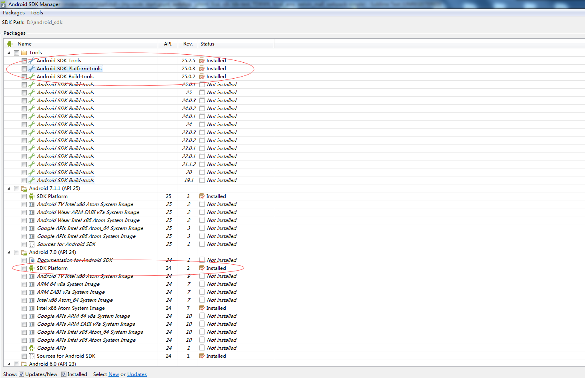

这里总结如何使用 `monkeyrunner` 来自动化测试 `android apk` 应用。

# 1. 环境准备

### 1.1 `python` 安装

下载 `python` 的 `msi` 包，直接点击 `next`，安装。

### 1.2 `java jdk` 安装

因为 `android sdk` 这些是基于 `java jvm`，所以需要需要 `java jdk` 环境

### 1.3 `android sdk` 安装

使用 `android sdk manager` 管理工具，来安装 `android sdk tools` 和 `android sdk platform_tools`。这里也需要安装一个版本的 `sdk platform`，
截图如下：

由于 `GWF` 的原因，使用 `google` 的源安装 `sdk` 比较困难，我们可以换成国内的源。[点击这里](http://www.jianshu.com/p/53080a8cbc95)

### 1.4 `windows` 下配置环境变量

`monkeyrunner` 是 `android platform_tools` 中提供的一个自动化测试接口工具。可以通过脚本来模拟 `APP` 业务流程。

这里配置

    JAVA_HOME=[你的 Java jre 文件存放根路径]

    ANDROID_HOME=[你的 Android sdk 文件存放根路径]

    Path=%JAVA_HOME%\bin;%JAVA_HOME%\lib;%ANDROID_HOME%\tools;%ANDROID_HOME%\platform-tools;C\python

这里这样设置，是为了可以在 `dos` 情形下，直接执行对应的命令，如 `python`, `monkeyrunner`。

至此，环境搭建成功。

# 2. adb

`adb` 全称 `android debug bridge`, 

# 3. adb shell

这里我们启动一个模拟器，安装某个 `APP` 应用，使用 `adb shell` 命令来发送指令到模拟器获取信息。

    adb devices

检查设备，每个模拟设备都有一个 `id`，通过上述命令检查。 

环境搭建成功后，我们要干什么？来个设备装上 `APK` 开始编写测试脚本，进行测试。
流程没有问题，问题是 `how`。网上也有很多测试脚本，大体流程：

    连接设备 -> 安装APK -> 执行操作

使用脚本安装一个模拟器

    emulator -avd test

如果执行报错，`PANIC: Could not find test.ini file in $ANDROID_AVD_HOME nor in $HOME/.android/avd` 可以看到文件不存在。

这时我们根据提示，来配置 `ANDROID_AVD_HOME` 环境变量。

# 参考

[android sdk 等工具安装](http://www.cnblogs.com/kangjianwei101/p/5621238.html#m5)

[Android自动化压力测试快速入门教程（图解）——MonkeyRunner](http://www.cnblogs.com/ITGirl00/p/4148287.html)

[一个简单的monkeyRunner例子](https://github.com/yeetrack/monkeyrunner)

[ADB Shell](http://adbshell.com/commands)

[天天模拟器正确USB调试连接方法](http://bbs.tyuyan.net/thread-51943-1-1.html)

[monkeyrunner api](https://stuff.mit.edu/afs/sipb/project/android/docs/tools/help/MonkeyRunner.html)