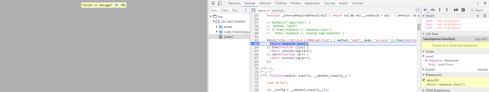
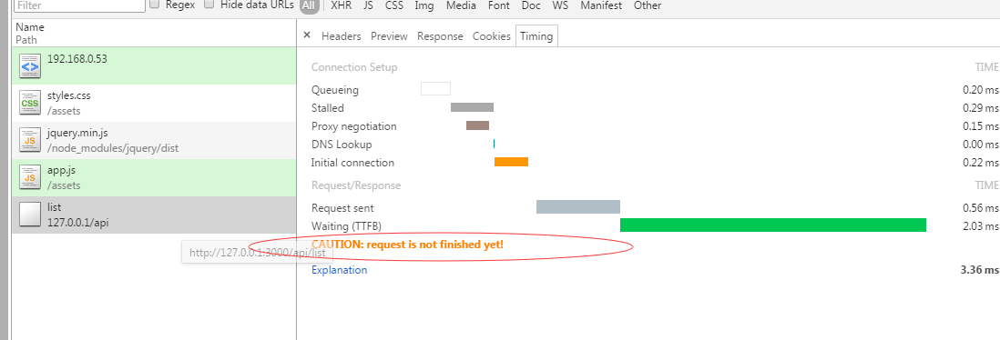

# 问题1

在使用 isomorphic-fetch 时，这个 Promise 在请求没有完全回来前就执行了。 why？

先上图：

代码继续运行，再看这个post请求，数据是回来了的。

我的客户端代码是按照示例代码写的：

	require("es6-promise").polyfill();
	require("isomorphic-fetch");

	fetch("http://127.0.0.1:3000/api/list", { method: "post", mode: "no-cors"})
	.then( response => response.json())
	.then( list => console.log(list))
	.catch( err => console.log(err));

我怀疑是不是我的服务器应答写得有问题，还是什么的？

ps: ajax 请求是正确返回的。

---

最后发现这个地方是服务端设置的问题。在服务端的 app 中为每个应答加上可以跨域访问的头部，就可以了。

	app.all("*", function(req, res, next) {
		res.header('Access-Control-Allow-Origin', '*');
	  	res.header('Access-Control-Allow-Headers', 'Content-Type, Content-Length, Authorization, Accept, X-Requested-With , yourHeaderFeild');
	  	res.header('Access-Control-Allow-Methods', 'PUT, POST, GET, DELETE, OPTIONS');
		next();
	})

# 问题2

> Fetch API cannot load http://127.0.0.1:3000/api/list. 
> A wildcard '*' cannot be used in the 'Access-Control-Allow-Origin' header when the credentials flag is true. 
> Origin 'http://192.168.0.53:4000' is therefore not allowed access.

[q1](http://stackoverflow.com/questions/19743396/cors-cannot-use-wildcard-in-access-control-allow-origin-when-credentials-flag-i)