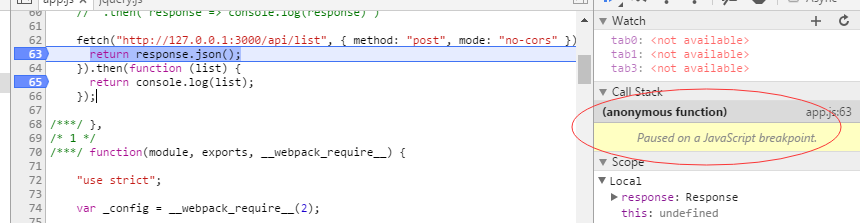

## 先说说 Promise 的不好的地方

Promise 不会在栈中显示调用过程，这样如果有错的时候，就不好处理：

[谈谈使用 promise 时候的一些反模式](http://efe.baidu.com/blog/promises-anti-pattern/)

## Promise 对象

	Promise.resolve().then(function() {
		doSomething();
		return "result";
	}).then(...).catch(function(err) {
		console.log(err);
	})

Promise 解决了 `call hell`, `return` , `catch` 这些的使用问题。

一个 Promise 对象和 resolve, reject 操作。

现在有下面这个场景：我们有个函数，这个函数里面有抛出错误，有返回值。例如：

	function promiseTest(result) {
		result ++;
		console.log(result);
		if(result === 2) {
			throw new Error("Oops, result = 2");
		}

		return result;
	}

使用构造函数来做；

	var p1 = new Promise(function(resolve, reject) {
		resolve(promiseTest(0));
	});

	p1.then(promiseTest).then(promiseTest).catch(function(err) {
		console.log(err);
	})

一个更好的写法：

	Promise.resolve(function() {
		return promiseTest(0);
	}).then(promiseTest).catch(function(err) {
		console.log(err);
	})