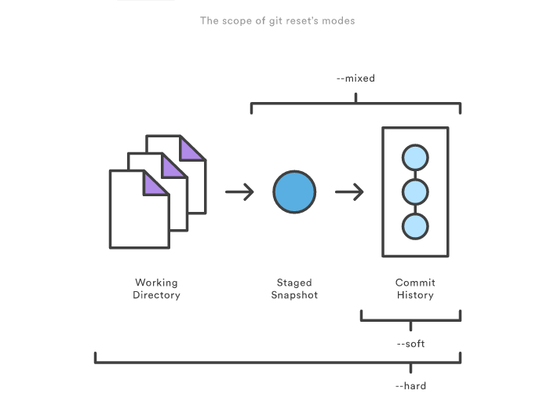
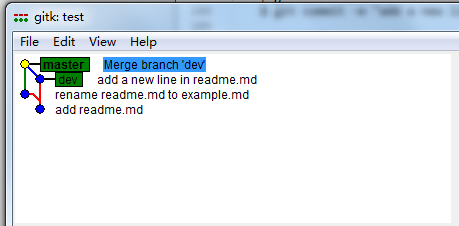

在这里介绍 git 的控制台命令

git 操作流程一般：

1. 初始化一个仓库， 或者 clone 一个已有的仓库

2. 修改文件， 添加修改的文件到暂存区（Index）

3. 提交修改文件到 HEAD 区

### Step1

初始化一个仓库

	> mkdir a-git-pro
	> cd a-git-pro
	> git init 

clone一个已有的仓库

	> git clone git@github.com:kuangcaibao/blog.git [name]

	> git clone https://github.com/kuangcaibao/blog.git [name]

	> git clone ../blog [name]

### Step2

现在有一个仓库了，我们需要干点事。修改，添加文件， blabla ...

`git status`

检查当前分支下修改过的文件。

`git add`

添加文件到暂存区（Index）中。可以 

`git add <filename>` 添加单个文件

`git add *` 添加所有的修改文件

### Step3

`git commit -m [msg]`

提交修改文件到 HEAD 区，会有一个 commit SHA 值，表示版本号。

### 分支操作

`git checkout -b [branck-name]`  在当前分支上签出一个新的分支

### 版本回退

`git reset [版本号]`

将当前分支的  head 指向你需要的版本号, 注意这时还没有删除掉你的提交.

场景:

1. 在 master 分支上, 我 commit 了一个版本, 版本号为 172c...

2. 在 dev 分支上, 我修改后, commit 到 dev 分支一个版本, 版本号为 2b9d...

3. 现在我切换会 master 分支, 执行 `git merge dev` 操作, 将 dev 分支上的最新代码合并到 master 上. 版本号 1301...

这时, 我突然发现这个合并的分支破坏了我原来 master 上的结构. 所以我需要废弃这个版本. 执行操作

`git reset --hard 172c`   返回到merge前的版本.

reset有一些参数:

`--soft`  缓存区和工作目录都不会改变

`--mixed` 默认选项, 缓存区会改变, 工作目录不会改变

`--hard`  缓存区和工作目录都会改变

效果图:

### 追踪操作

	git track

<http://gitbook.liuhui998.com/4_7.html>

场景: 

	$ mkdir test
	$ cd test
	$ git init
	// 在 master 分支上
	$ echo "Hello World" > readme.md
	$ git add readme.md
	$ git commit -m "add readme.md"

	$ git checkout -b dev
	// 这时切换到 dev 分支上了
	$ echo "a new line" >> readme.md
	$ git add readme.md
	$ git commit -m "add a new line in readme.md"

	// 切换到 master 分支
	$ git checkout master
	$ mv readme.md example.md
	$ git status
	On branch master
	Changes not staged for commit:
	  (use "git add/rm <file>..." to update what will be committed)
	  (use "git checkout -- <file>..." to discard changes in working directory)

	        deleted:    readme.md

	Untracked files:
	  (use "git add <file>..." to include in what will be committed)

	        example.md

	no changes added to commit (use "git add" and/or "git commit -a")

	$ git add *
	$ git status
	On branch master
	Changes to be committed:
	  (use "git reset HEAD <file>..." to unstage)

	        new file:   example.md

	Changes not staged for commit:
	  (use "git add/rm <file>..." to update what will be committed)
	  (use "git checkout -- <file>..." to discard changes in working directory)

	        deleted:    readme.md

	$ git rm readme.md
	$ git status
	On branch master
	Changes to be committed:
  		(use "git reset HEAD <file>..." to unstage)

        	renamed:    readme.md -> example.md
    $ git commit -m "rename readme.md to example.md"

    // 将分支 dev 的修改 merge 到 master 上
    $ git merge dev

版本迭代图:

可以看到 dev 上的 readme.md 文件的内容合并到了 master 的 example.md 文件中. 而不是我期望的 2 个文件: readme.md 和 example.md .  why?  怎么解决能得到我需要的效果???

# git pull

1. `git pull` 去远程仓库去内容，合并到当前分支上。如果要取消 `git pull` 操作，只需执行 `git reset --hard`.

# git tag

	> git tag

显示所有的标签

	> git tag -d <tag name>

删除某个标签

	> git tag <tag name>

在当前版本上创建标签

	> git push <remote> <tag name>

将某个标签上传到远端服务器上

# 删除远程分支

	> git push <remote name> :<remote branch>