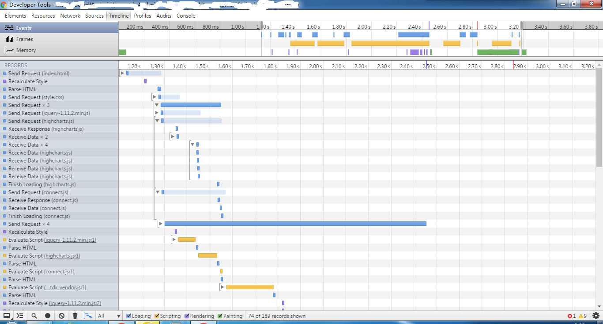
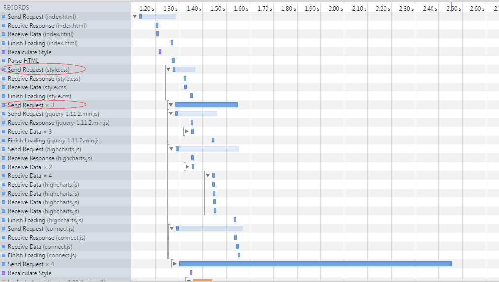
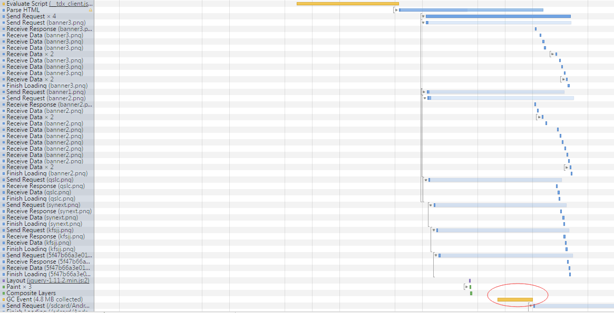
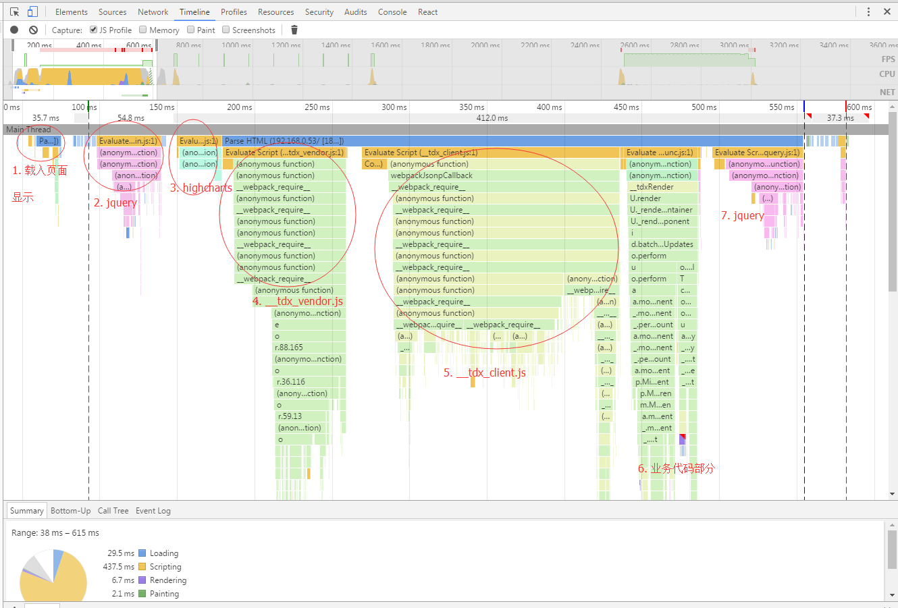
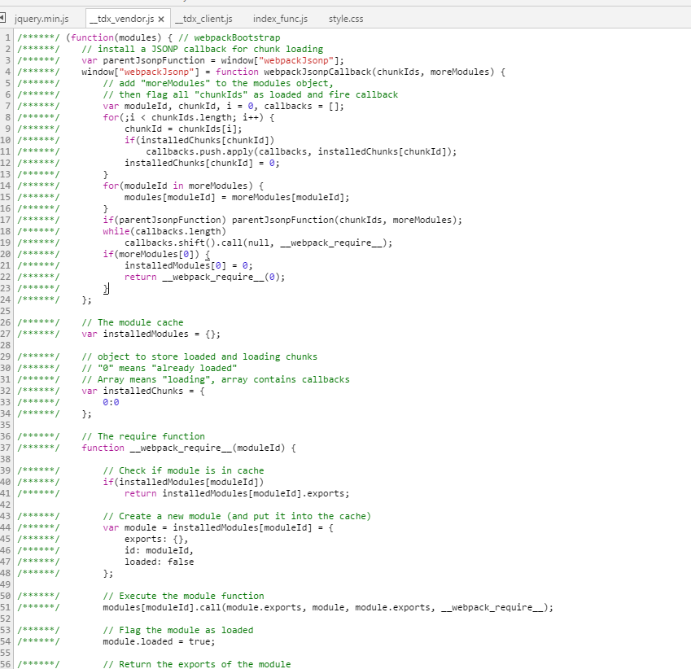

在这里介绍移动App中嵌入网页，优化页面显示速度。

# 前言

最近在Boss的要求下，写组件模式的移动页面。这里选择的库是react。（为什么？ 入门简单 + JSX）。

在经过愉快的编写组件后，打包组件形成组件库文件，然后被页面引用。配置到 App 中后，run···，发现界面显示出来很慢，2s左右才会出现界面和数据。

不开心了，速度太慢。所以准备分析慢的原因。所以有了这篇笔记，新手，轻喷。

# 工具：Chrome developer tools

为什么2s左右才会出现，使用工具测试了下。`chrome dev tools` 下的 `timeline` 分析工具很赞。

具体操作方法：

1. 在 `chrome` 浏览器地址栏输入 `chrome://inspect`  这个是远程调试工具，调试 App 应用中的 html 神器。

2. 选择 `chrome` 下检查到的你的网页，点击 inspect 进入就行。

	> 这里你的手机应该是连着电脑的。

3. 选中 `timeline` 工具，打开分析，刷新网页。  结果就出来了

效果如图：

# 分析

### 1. 根据 url 加载 html 文件

 

读取 url 后，webkit 调用资源加载器加载 html 资源。在上图中可以看到触发了6个操作。

我们从时序上开始分析。

1. `Send Request` 根据url取资源文件，请求发送

2. `Receive Response` 应答返回时，触发这个

3. `Receive Data` 接受资源文件内容，如果文件比较大的话，会触发多次

4. `Recaculate Style` 重新计算样式，根据html返回的内容，计算样式

5. `Finish Loading` 文件处理完成

6. `Parse HTML` 显示页面？？？

步骤6在手机浏览器中，是会提前显示出来的，但是在 App 中怎么会不显示呢？（这个求大神解决下）

### 2. html文件弄好后，开始做里面的资源文件了

附上 `html` 代码：

	<!doctype html>
	<html>
	<head>
		<title>Test</title>
		<meta charset="utf-8">
		<meta http-equiv="X-UA-Compatible" content="IE=edge,chrome=1"/>
		<meta name="format-detection" content="telephone=no" />
		<meta name="apple-mobile-web-app-capable" content="yes" />
		<meta name="apple-mobile-web-app-status-bar-style" content="white" />
		<meta name="viewport" content="width=device-width, initial-scale=1, minimum-scale=1.0, maximum-scale=1.0, user-scalable=no" />
		<link rel="stylesheet" type="text/css" href="../../tlibs/style.css">
	</head>
	<body style="overflow: hidden;margin:0;">
	

Hello World

	

	</body>
	
	
	
	
	
	
	
	</html>

html页面中有节点 `script`, `link` 遇到这些 `Webkit` 又要调用资源加载器来加载资源了。效果图如下：

可以看到，这些资源请求是异步的，就是说请求资源的请求是同时发出去的，没有等上个资源返回后再发送。

资源的加载重复上面加载 html 页面的过程: `send request -> receive data -> caculate (scripting 部分) -> finish`。

在当前情形下，`jquery` 回来后，开始 `scripting`, 接着是 `highcharts`, ···

`scriping` 这个部分是线性的，javascript 的特性。

### 3. css，js文件解析过程中

css, js文件解析过程中，又有 url 链接图片什么的，又是请求发送。

### 4. 在App中出现页面的最后时刻

在 App 中出现页面的最后一刻，有个 `scriping` 的过程，这里的触发事件在左侧显示为 `GC Event`, 这个是什么东西？？？

# 优化思路

通过上面的分析，优化页面显示的时间，个人认为主要有几个方向：

1. `Send Request <--> Receive Response, Receive Data`

	这个过程中，如果你的页面是远程服务器上，那么这个就和网络有关了，网络要好，文件要压缩变小。

	对于多个文件是否要合并为一个文件，从 `timeline` 时序上看，请求是并行的，如果带宽和请求链接数没有限制的话，个人感觉分开请求比较好。

	当然也不能太多了，每个文件几k，这样就合并就没有天理了。

2. `scripting` 阶段，这个是读js代码逻辑，就是把js文件执行一遍。  这里的优化就看你的业务逻辑了。

3. 图片资源，动态图下载，图片请求的 `Send Request <--> Receive Response` 之间的响应太长了，

	中间还涉及了一个 `GC Event`, 这个有什么用？？？

	如图：

	 

对于目前个人的需求，文件放在本地，所以

> 优化1，这里合并文件效果不大。

> 优化2，

> 对于外部引用，可以去掉外部引用组件逻辑，例如 jquery, highcharts 这些，或者找个好点的库。

> 对于自身的逻辑，最好分析下流程，看看哪里耗时

> 优化3，那个 `GC Event` 的作用还不怎么清楚，研究中。

还有一个想法是调用 `React` 中 `server` 的 `renderToString` 方法，先生成静态页面，显示内容。这里就是在载入 html 页面后，直接显示。

设想的结果：

1. 载入html，显示出来

2. 现在js，css，图片等资源文件，准备好后更新页面

这样可以消除页面准备过程中，空白的问题。想法很好，但是现实很骨感。 在 App 中载入 html 页面尽然没有显示出来，非要等js准备好后，才显示界面，

这是为什么？？？（设想结果1没有）

在手机的浏览器中就么有这个问题？？？ why ？？？

# 个人代码部分分析

手机App中，看到有2个js文件耗时很大: `__tdx_vendor.js`, `__tdx_client.js`

这是2个什么文件，总的来说，我这边文件引入的库是 React，所有的文件通过 webpack 打包形成这2个文件。 

具体的时序图，在 `chrome://inspect` 中看不到，我们直接在浏览器中打开分析：

 

先不考虑外部文件的效率。

webpack 打包后的文件，需要读取的时候，每个都要花费这么长的时间？？？

在 __tdx_vendor.js 中只有 react 和 react-dom 的 dist 文件。内容如下：

 

这里只是贴了前面的部分，所有的module都在这个自执行函数的参数中。一个个的参数开始执行并缓存下来。

# 问题

感觉说的有点乱，目前存在的问题：

1. html加载完成，js，css等文件没有finish的时候，在浏览器中会先显示html原有的内容，然后再更新。但是在 App 中的 WebView 组件为什么没有这样的显示逻辑。

测试代码:

	// index.html
	<!DOCTYPE html>
	<html>
	<head>
		<title>Test</title>
		<meta charset="utf-8">
		<meta http-equiv="X-UA-Compatible" content="IE=edge,chrome=1"/>
		<meta name="format-detection" content="telephone=no" />
		<meta name="apple-mobile-web-app-capable" content="yes" />
		<meta name="apple-mobile-web-app-status-bar-style" content="white" />
		<meta name="viewport" content="width=device-width, initial-scale=1, minimum-scale=1.0, maximum-scale=1.0, user-scalable=no" />
	</head>
	<body>

	<h1 id="page">This is a static page</h1>

	</body>
	
	</html>

	// index.js
	!function() {

		var date = new Date();
		var curDate = null;
		do {
			curDate = new Date();
		} while (curDate - date < 5000);

		setTimeout(function() {
			var el = document.getElementById("page");
			el.innerHTML = "This is a second page";
		}, 5000)
	}()

> 如果后面找到解决方案，会更新到后面。

# 参考

[使用Chrome DevTools的Timeline分析页面性能](https://segmentfault.com/a/1190000003991459)

[Webkit技术笔记(2):详解 webkit 网页渲染过程](http://www.w3ctech.com/topic/281)