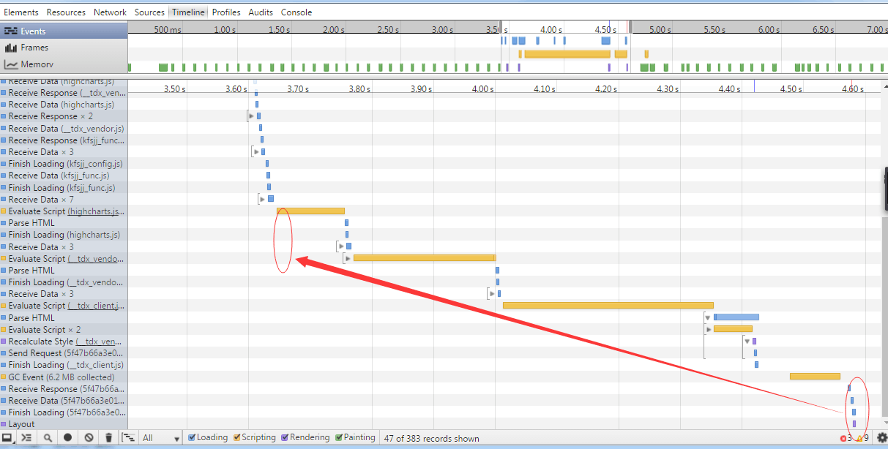
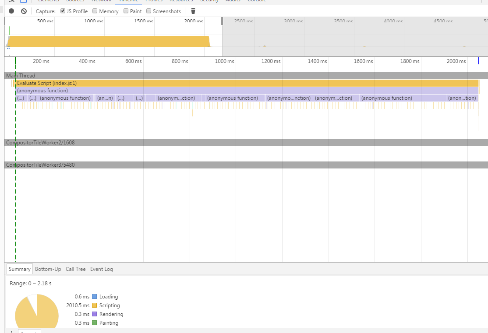
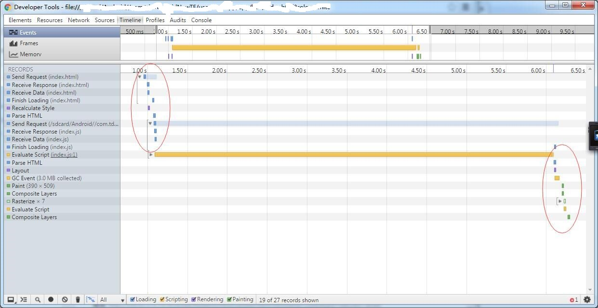
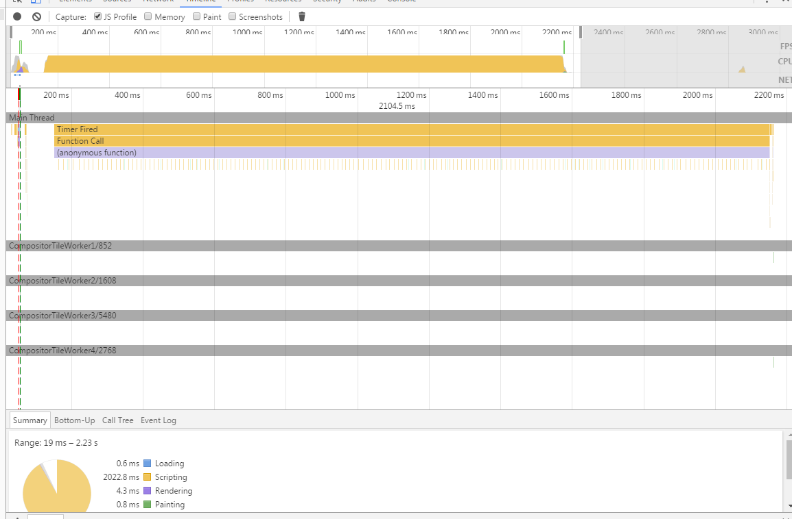
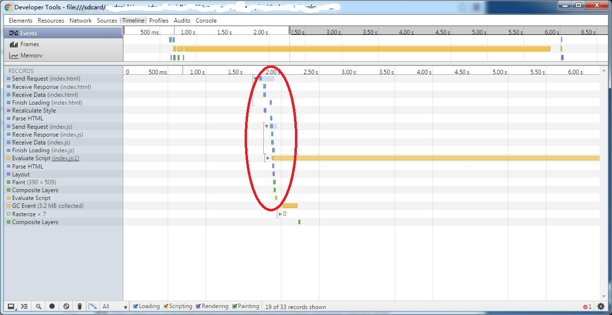

我们优化的目标是什么：使界面早点显示出来，数据是否正确可以等待查询的返回来更新。

# 前言

上篇介绍了代码优化的方向：

1. 去掉耗时的 jquery

2. 优化个人代码

# 去掉耗时的 jquery

代码中用到 jquery 的地方，主要使用 jquery 的选择器函数，extend函数，添加节点函数。

[jquery等价dom原生操作](./20160603_1.md)

去掉了 jquery 的部分，虽然快了 200ms 左右，但是然并卵，开始界面的一段空白还是很丑。

 

最好的优化效果是把后面红框中的时序放到前面红框中。就是下面的操作方式，来个 `setTimeout`

# 优化个人代码

上篇中的示例我们再测试下：

	!function() {

		var date = new Date();
		var curDate = null;
		do {
			curDate = new Date();
		} while (curDate - date < 2000);

		setTimeout(function() {
			var el = document.getElementById("page");
			el.innerHTML = "This is a second page";
			console.log(2);
		}, 2000)
	}()

当 `index.js` 的逻辑是上面这样的时候，界面有时会等到 `2s` 执行完成后才会渲染出来，有时没有。为什么？因为如果卡顿的话
可能是先执行了上述卡顿 `2s` 的操作。这里先渲染界面还是执行js，具有不确定性，但是 Timeline 的时序分析是固定的，把 `2s`
的运行时间计算在内了，如图：

 

不过，如果我们把上面的 `index.js` 内容改成如下的形式：

	!function() {

		setTimeout(function() {
			var date = new Date();
			var curDate = null;
			do {
				curDate = new Date();
			} while (curDate - date < 2000);

			console.log(curDate - date);
		}, 100);

		setTimeout(function() {
			var el = document.getElementById("page");
			el.innerHTML = "This is a second page";
			console.log(2);
		}, 2000)
	}()	

则时序分析结果如下图：

 

 

可以看到在手机中，时序显示不一样了，界面先出来了！

# 总结

在这种思想下，我们需要重写我们的 `html` 页面，修改后代码如下：

		<!doctype html>
		<html>
		<head>
			<title>Test</title>
			<meta charset="utf-8">
			<meta http-equiv="X-UA-Compatible" content="IE=edge,chrome=1"/>
			<meta name="format-detection" content="telephone=no" />
			<meta name="apple-mobile-web-app-capable" content="yes" />
			<meta name="apple-mobile-web-app-status-bar-style" content="white" />
			<meta name="viewport" content="width=device-width, initial-scale=1, minimum-scale=1.0, maximum-scale=1.0, user-scalable=no" />
			<link rel="stylesheet" type="text/css" href="../../tlibs/style.css">
		</head>
		<body style="overflow: hidden;margin:0;">
		
<h1 style="color: red;">Hello World</h1>

		

		</body>
		
		</html>

第一步，我们确认，`html` 页面载入后，界面是会显示的。

第二步，我们需要将页面静态化，就是先生成静态页面。

这里涉及到 `React` 的服务器端渲染，生成静态文件，原来这里是为了 `SEO` 优化时提到的。

	import { renderToString } from "react-dom/server"