在这里介绍 git 的用法，纯笔记。

## 什么是版本管理系统

下面有一个场景，你写了一个软件，发布了版本（1.0.0）。线上运行了一段时间后，有客户端觉得某个功能点不好，想你提出了修改。我们不使用版本管理系统会怎么做？

1. 备份当前版本代码，比如放在文件夹里 1.0.0
2. 我们将代码 copy 到文件夹 1.0.1 
3. 修改 1.0.1 中的代码

到目前来说，这样做还可以接受。假设你改着改着的过程中，突然发现这种实现思路不对，想恢复到某个时间段的版本。可以做吗？抱歉做不了，因为你可能不知道哪些文件改了，哪些文件的修改需要保留。

代码版本管理就是干这种事的。

## svn

svn是一个集中式的代码管理系统。有一个中央代码库，不同的开发人员可以从中央仓库中checkout代码，然后修改。这样就有个问题，如果A和B都想修改同一个文件，那么只能一个一个排队。bad

另外一个缺点，这个必须联网。就是要登录到中央仓库。

不要用了吧

## git

这是一个分布式的代码管理系统。什么意思？就是每个人的机器上的代码库都可以做中央仓库。同时又是离线了。

每个人都可以做中央仓库，那么就会有修改冲突， 怎么解决？？？

## 一个实例, github 实例

假设现在有2个github账户： kuangcaibao 和 kuangcaibao2

### 一个没有冲突的 pull request

账户 kuangcaibao 现在 github 上创建一个项目。添加文件 test.txt , 内容如下：

	我刚在这里创建了一个文件。

这时账户 kuangcaibao2 在 github 上 fork 了 kuangcaibao 的代码。

账户 kuangcaibao2 现在在自己的项目中修改了 test.txt 文件, 新的内容如下：

	// 我刚在这里创建了一个文件。

	我在这里修改了你的文件。

这时 kuangcaibao2 账户界面上显示内容如下：

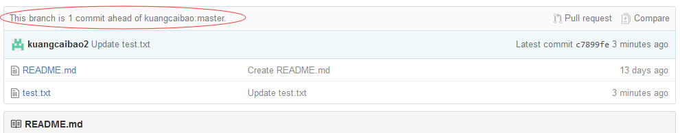

> This branch is 1 commit ahead of kuangcaibao:master

看到 kuangcaibao2 的代码有一个 commit 在他 fork 的代码之前了。

现在我们来点击 kuangcaibao2 项目的 compare 功能。可以看到如下的信息：

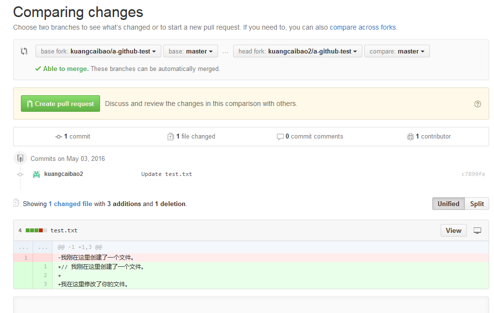

可以合并，好吧。我们来创建一个 pull request 。

pull request 创建了，这时在 kuangcaibao 的项目界面可以看到一个 pull request 请求了。

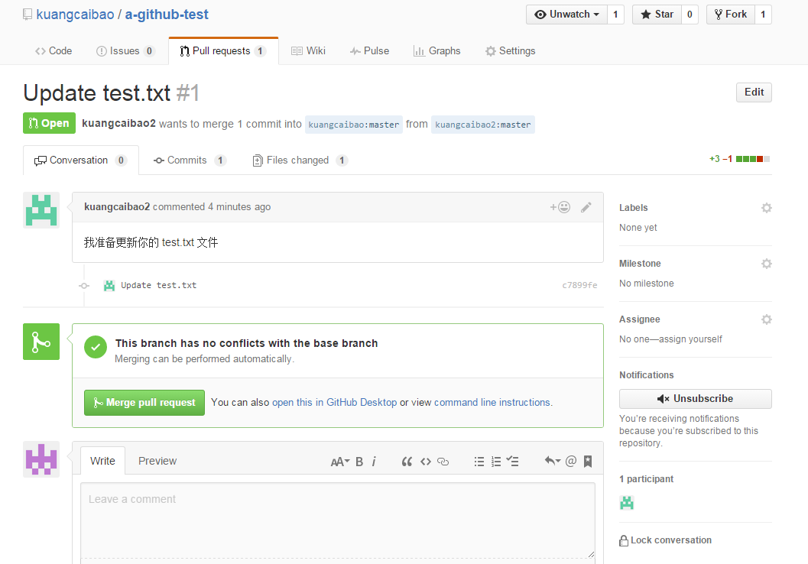

我们通过 files changed 功能，来看看修改了哪些文件。

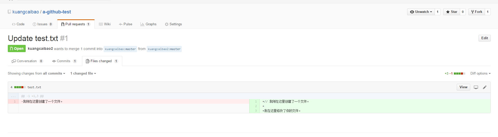

ok, kuangcaibao 看到 kuangcaibao2 的修改是可以的，现在他要把这个 pull request 合并到他的项目中。

好的，到这里 kuangcaibao 和 kuangcaibao2 进行了一次愉快的玩耍。

### 一个有冲突的 pull request

现在 kuangcaibao 和 kuangcaibao2 都对 test.txt 进行修改。

账户 kuangcaibao 的修改：

	// 我刚在这里创建了一个文件。

	我在这里修改了你的文件。

	我在这里添加了内容 - kuangcaibao

账户 kuangcaibao2 的修改：

	
	// 我刚在这里创建了一个文件。

	我在这里修改了你的文件。

	我也在这里添加了内容 - kuangcaibao2

这时，kuangcaibao2 的 compare 功能界面是这样的：

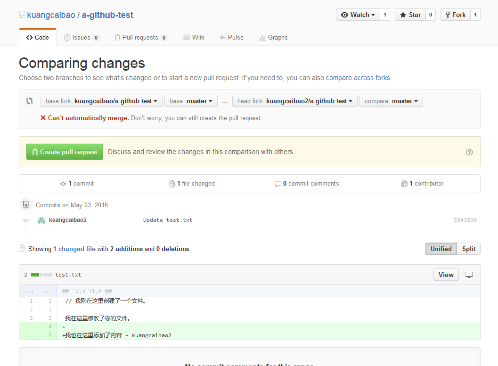

冲突了，不能自动合并了。但是还是可以创建 pull request 的。我们来创建一个 pull request。

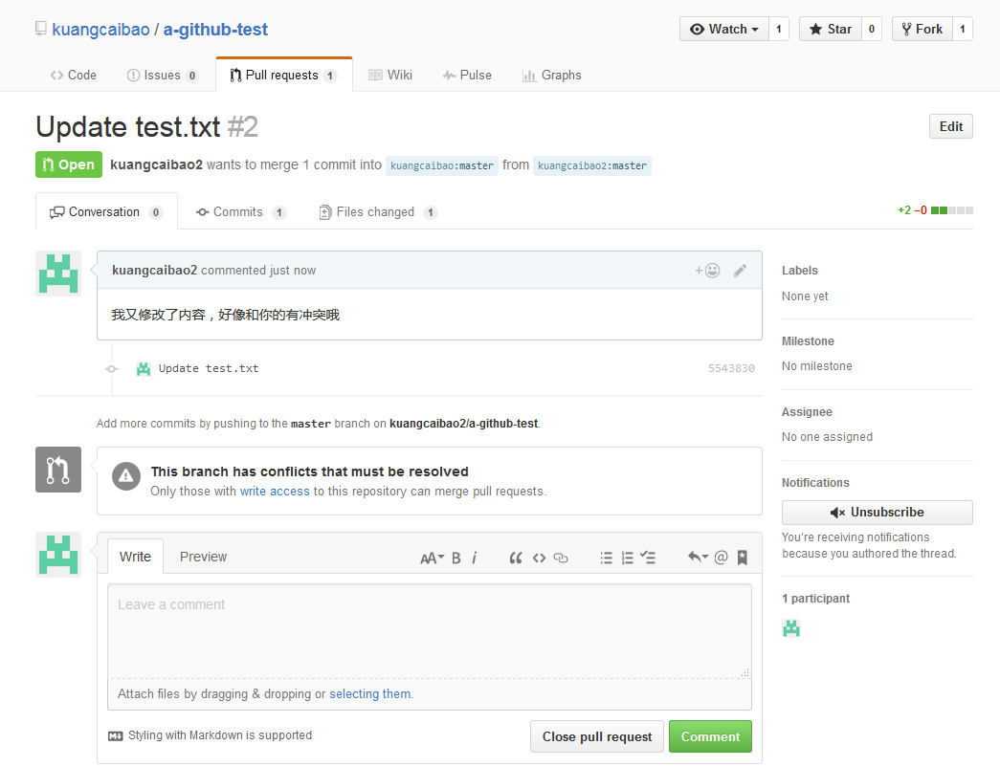

===

冲突了，我们看看 github 界面给我们什么提示？

> If you cannot merge a pull request automatically here, you have the option of checking it out via command line to resolve conflicts and perform a manual merge.

如果不能自动合并，你可以通过命令行来手动解决冲突，并合并。

> Step 1: From your project repository, check out a new branch and test the changes.

> git checkout -b kuangcaibao2-master master

> git pull https://github.com/kuangcaibao2/a-github-test.git master

> Step 2: Merge the changes and update on GitHub.

> git checkout master

> git merge --no-ff kuangcaibao2-master

> git push origin master

第一步：

1. 把自己主分支的代码checkout到分支 kuangcaibao2-master 上

2. 把 kuangcaibao2 的主分支更新到本地的master分支上

这个时候会有如下的截图的效果：

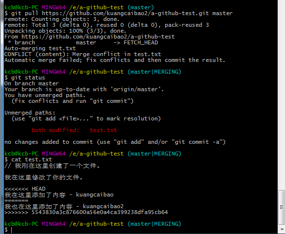

第二步：

上面的命令执行没有效果，报错。

下面我们来看看差异：

	git diff

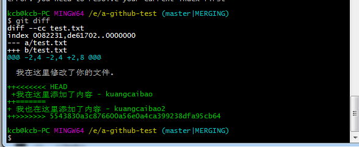

`<<<<<<< HEAD` 到 `=====` 之间的内容表示 HEAD 中有冲突的部分

`=======` 到 `>>>>>>>` 之间的内容表示 版本xxx 中与 HEAD 的冲突部分。

在这里看到这2个内容没有重叠的部分。

	git add test.txt
	git commit -m "resolve conflict"

好了，现在git不报冲突了，我们把修改的内容推送到 github 上吧。

	git push git@github.com:kuangcaibao/a-github-test.git master

或者
	
	git push origin master

在 github 上看到我们合并的内容，如下：

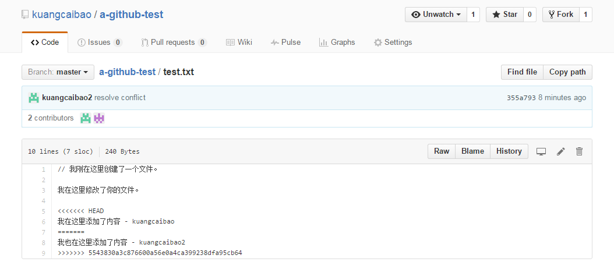

:( 内容多了一些，说明应该修改下内容

OK，到这里 kuangcaibao 账户解决了 kuangcaibao2 的 pull-request 的冲突，我们现在来看看 kuangcaibao2 在 github 上怎么更新他的代码库。

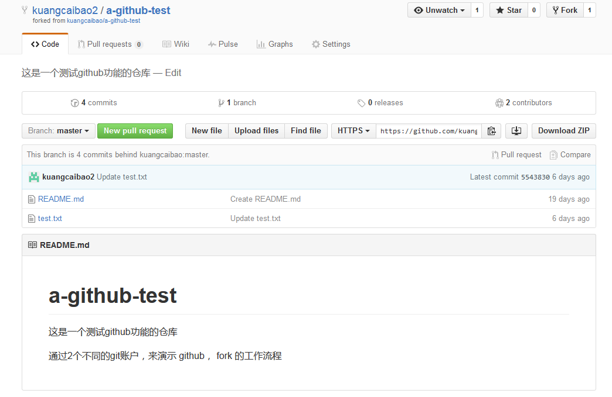

我们点击 compare 功能，比较 kuangcaibao 和 kuangcaibao2 的差异。以 kuangcaibao2 的 master 分支为 base 比较。结果如下：

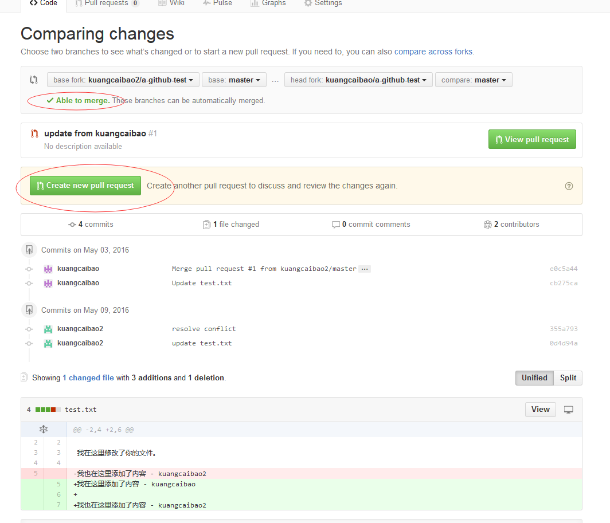

这时， 我们创建一个 Merge Pull Request , 自动合并内容。

大功告成！！！

当然实际项目中，差异的地方会比较多。但是合并的过程还是一样的。

---