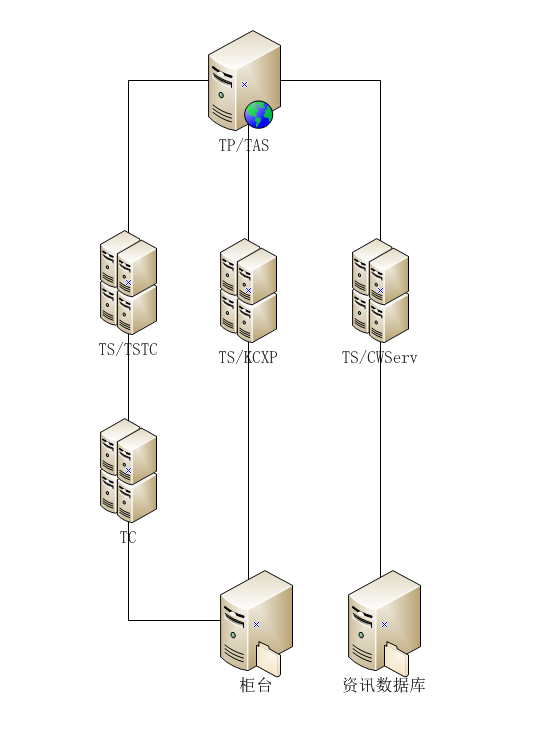
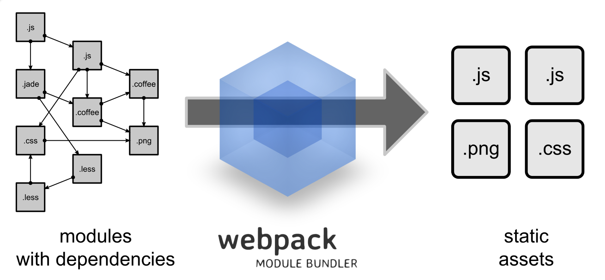
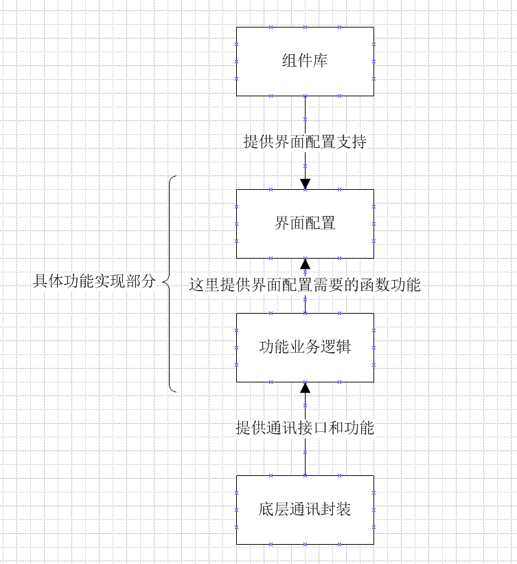

微信商城介绍

# 1. 背景介绍

当时设计的时候，确定商城部分的功能是：产品列表，产品详情的展示，具体的购买流程复用原有交易的功能。

要求：代码高可用，组件可替换（应对券商的个性化显示需求）

当时考虑是，后台业务逻辑，券商同柜台间差异性不大，界面显示差异大这点。

如何做：将业务数据，抽出来形成字段配置，用组件来适配数据结构，这样当多个组件具有相同数据结构，可以做到快速切换界面，保留业务逻辑的效果。

选择了 react

为什么不选择 angular？当时还是1.0。插件庞大，大杂烩

为什么不做成单页面应用？为了复用原有的交易网页功能

所以商城代码结构分成了 2 部分：组件部分 + 具体功能部分。

# 2. 商城后台网络拓扑

服务器的均衡问题

配置商城出现过的 operway 问题，这个均衡是根据 servid 来确定的

# 3. 代码结构

## 2.1 组件部分

形成的结果文件： `__tdx_client.js`, `__tdx_vendor.js`, `style.css`

介绍这3个文件分别包含哪些内容

1. webpack

    入口，loader

    

    如何抛出一个全局函数 expose

2. 如何写一个新的组件

    文件结构

        /src
          /items
          /layout
          /res
          index.js
        .babelrc
        package.json
        server.js
        webpack.config.js

    添加一个组件

    生成文件 `npm run build`

页面中布局示例

Q. 怎么调试react开发的component， webpack打包之前，怎么开发调试？

## 2.2 业务功能部分

文件结构

理财示例，以一个基金调用为例

也可以从 jyhtml 下面已经实现的功能，来取请求字段

# 4. 开发调试

## 4.1 如何调试，找错误

开发新功能，为了调试方便，可以本地起一个tp，然后把tp的请求都转到测试tp上

chrome 调试工具

代码中使用 try,catch   console.error

## 4.2 如何功能调用

手机APP，或者微信

说下 connect.js 的内容，几个变量： __webCallTql, __hqCallTql, __fwCallTql, __jyCallTql

APP 连接后台的几个服务器类型：行情TP，服务TP，TC交易中心

# 5. 新的文件组织结构

    /
      /css
        组件样式
      /pages
        组件内容
      /tlibs
        业务逻辑部分
      /zb
        业务功能部分
      config.js

测试地址  http://127.0.0.1:7615/site/webapp/app/zbshare/zb/wdfx.html

---

# 1. 如何定位问题

查询 log 日志

## 1.1 TP，TS 日志开启配置

    // configs/services.xml

    <LPC>
      <Log Module="*" Entry="*" Sensibility="1" Type="Full" OnlyOnFail="NO" SizeLimit="4096" AppLogLevel="1"/>
      <Log Module="*" Entry="*" Sensibility="2" Type="Full" OnlyOnFail="NO" SizeLimit="4096" AppLogLevel="1"/>
      <Log Module="*" Entry="*" Sensibility="*" Type="None" OnlyOnFail="YES" SizeLimit="2048" AppLogLevel="1"/>
    </LPC>

`Module` 模块名称，如 RSACrypto, SAM, TAS...

`Sensibility` 功能说明，1 - 关键功能，2 - 重要功能，3 - 标准功能  功能说明，可以在 TP、TS 中

`Type` 是日志类型，FULL表示完全记录，None表示不记录

log文件路径：/log/[当天日期].log

## 1.2 TC 日志开启配置

    // modules/JzxpWin/JzxpWin.ini

    [PUBLIC]
    trace=1

根目录下的 dat 文件，log 文件夹下的 log 文件

## 1.3 APP

手机 APP 中也可以把日志打开，但是这个日志对我们的页面开发用处不大。

APP 端直接调试，在 chrome 中查看数据类型。

---

# 1. 手机 APP 原生配置项

目录结构

    /
      / config
        ios 行情配置
      / hqcfg
        Android 行情配置
      / jycfg
      / misc
      / skin
      / syscfg
      / tmp
      / user
      / webApp

配置后台服务器地址  taapi.xml

皮肤文件夹 skin