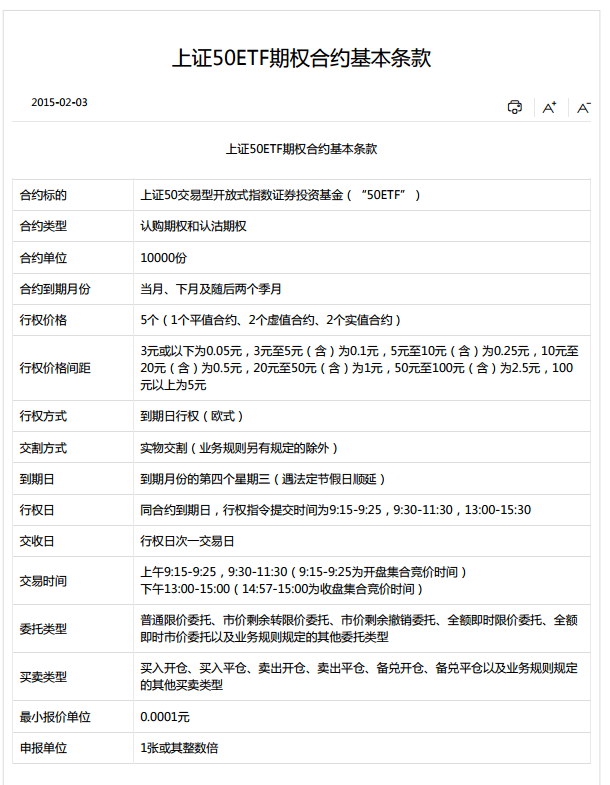
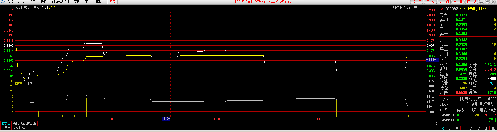

# 1. 什么是期权

期权是一种权利或义务的合约，是对应标的物的衍生品的合约。

一个合约有如下的几个要素：

- 合约类型：

	认购和认沽

- 合约标的：

	某个标的物，如上证50ETF这个基金，或者某个股票标的

- 合约到期日：

	这里分为2种：欧式，合约到期日才可以行权；美式，合约到期之前的任意一个交易日都可以行权，更灵活。目前上交所采用的是欧式。

- 行权价：

	行权时，买入或者卖出的标的价格

- 合约单位： 

	一张期权合约对应的合约标的物数量

- 行权价格间隔

- 交割方式：

	实物交割是指在期权合约到期后，认购期权的权利方支付现金买入标的资产，
	认购期权的义务方收入现金卖出标的资产，或认沽期权的权利方卖出标的资产收入现金，
	认沽期权的义务方买入标的资产并支付现金。

	现金交割是指期权买卖双方按照结算价格以现金的形式支付价差，不涉及标的资产的转让。 

完整的要素介绍，[戳这里](http://www.sse.com.cn/assortment/options/contract/c/c_20151016_3999892.shtml)

# 2. 参与人员

以上交所的股票期权为例：

- 上交所 			

	期权合约的制定机构，制定合约的要素，规则起草者

- 券商 

	投资者开户的地方（期权经营机构），可以理解为裁判

- 投资机构或个人

	参赛选手

开户有限制条件，这里不罗列了。

在这里总结下：

1. 期权合约由交易所制定，制定的合约内容包括（以上证50ETF期权合约为例）：

	

	

1. 投资者在期权经营结构（券商）开立账户，期权经营机构交割合约，向投资者交付其应收的合约标的和资金。

1. 投资者又要在券商那里开个户了。这个账户有保证金，资金等等。来张账户的贴图：

	

这里为什么没有保证金？？？明天买个认沽合约试试保证金是怎么收的。

# 3. 买卖

没有买卖，就没有伤害。呵呵。

交易所制定合约基本要素后，还有一些因素需要确定，这个就是市场确定的，如合约价格，保证金，权利金这些。如果计算？目前不清楚，到时研究下。

个人理解，除了你可以行使权力或者兑现义务外，期权和股票也是是差不多的。可以交易，这个交易，就是合约的现价交易什么的。先来个期权合约的行情

是不是和股票交易的有点相像，感觉就是一样的，不过就是多了一个在行权日是否行权的过程。

好了，我们以一个认购的合约来理下我们的交易过程。T日我买入了一张 `10000555` 合约，价格是 `0.3342`。这时我支付的权利金是多少呢？
`0.3342 * 10000 = 3342 元`，还剩 `55` 天到期。目前我们有什么？

1. 有个市值 3342 元的合约，你可以卖出，如果有人要的话。（类似于股票的交易）

2. 我有个权利，在55天后，以价格 `1.8500` 买入 `50ETF` 10000股的权利

在这个期间，如果合约的市值涨到了 10000 元，你可以卖出合约，赚了 10000 - 3342 = 6658 元 （在不考虑各种手续费的情形下）

如果你一直持有这个合约直至行权日，这是 50ETF 的价格涨到了 3 元，这时如果你选择行权的话，利润： （3 - 1.85）*10000 = 11500 元